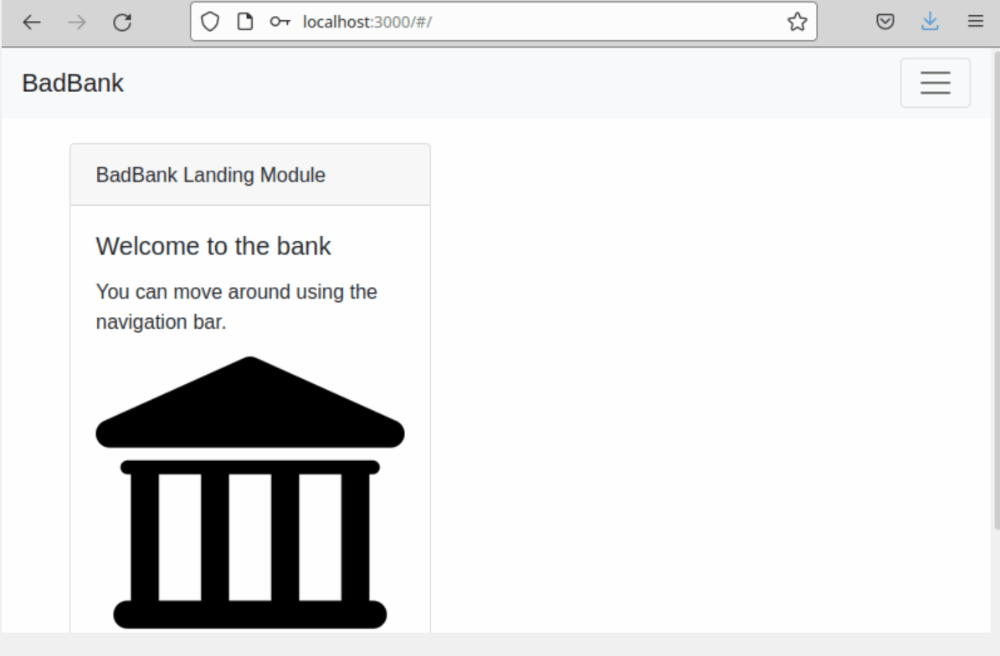

<h1>Bad Bank</h1>

This is a project created following the MIT X Pro curriculum.

This project can be ran by cloning or downloading source code from Github. Running npm init and installing package.json dependencies.

Below is a GIF of the application demonstrating its functionality by creating an account, depositing funds, checking the balance, and finally checking all the user data that is stored.

<h3>Technology </h3>

This application was created using the MERN stack short for:
<b>MongoDB, Express, React, and Node</b>

<h3>Features</h3>

This Bad Bank aplication currently has the ability to:
<ul>
Create an account.
</ul>
<ul>
Login to accounts.
</ul>
<ul>
Deposit "funds" into accounts.
</ul>
<ul>
Withdraw "funds" from accounts.
</ul>
<ul>
Check the fund balance of accounts.
</ul>
<ul>
Check all the accounts data on one page.
</ul>

<h3>Future features I would like to  include are:</h3>
<ul>
Authentication
</ul>
<ul>
Transaction page
</ul>
<h3>License</h3>
 
"license" "MIT"